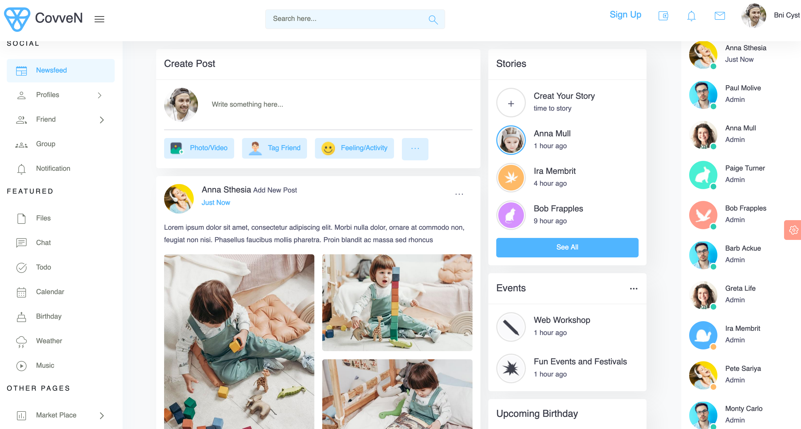
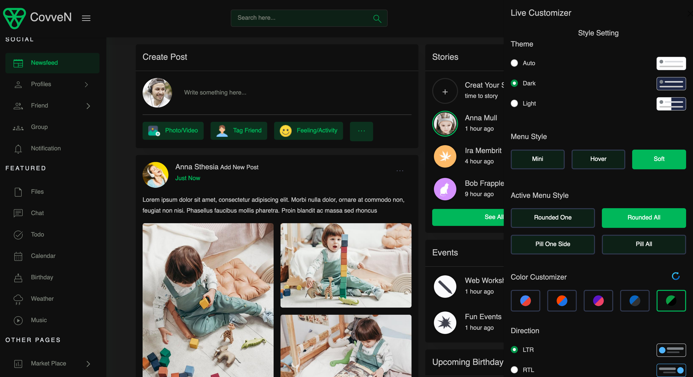

# COVVEN
### A decentralized SocialFi application on the Binance Smart Chain.

## Overview
-mvp
-customized lenshub social graph implementation


## Live Project
See the live application here: [Live Version](https://resonant-druid-87de9c.netlify.app/)


## Contract Addresses on the Binance Smart chain (Testnet)
1. LensHub: "0x1C0328cC3CE6B111455cABee83B30B0331Be2382"   [Explore on BSC Scan](https://testnet.bscscan.com/address/0x1C0328cC3CE6B111455cABee83B30B0331Be2382)
2. FollowNFT: "0xBEf57D662972B07E4926ed091805A9C0dbdfCB83",   [Explore on BSC Scan](https://testnet.bscscan.com/address/0xBEf57D662972B07E4926ed091805A9C0dbdfCB83)
3. CollectNFT: "0x3B4Fa1A2Ae775303F520c8Ee924b033e138D14Cd", [Explore on BSC Scan](https://testnet.bscscan.com/address/0x3B4Fa1A2Ae775303F520c8Ee924b033e138D14Cd)


## Screenshots
- Fully rsponsive UI on any device




## Problem Statement
- Corporate entities control major social media sites, and a small group of people within these companies sets the rules of engagement. 
- This has raised concerns about free speech and censorship among users.

## Our Solution
- Covven is a A decentralized social network which allows users more control.
- This application is censorship resistant, gives ownership to users over personal data, and improved control over user-generated content.


## Built With
- Binance Smart Chain
- Solidity
- React/Redux
- JavaScript
- Typescript
- IPFS
- Hardhat
- Ethers
- Quicknode
- HTML5
- CSS3
- Bootstrap

## Getting Started
Follow the simple intructions below to explore the application either on the live version or locally on your computer.

### Live Version
See the live application here: [Live Version](https://resonant-druid-87de9c.netlify.app/)

#### Prerequisites
- Metamask wallet (Connected to the BSC testnet network)

### Local Version

#### Prerequisites
- You must have node installed on your computer. [Download Node.js](https://nodejs.org/en/)
- Metamask wallet (Connected to the BSC testnet network)

#### Steps
- Go to the "Code" section of this repository and press the green button that says "Code". Copy the URL or the SSH key.
- Go to the terminal and run:
```
git clone https://github.com/george-shammar/coven.git
```

The URL or SSH are the links copied from the step above.

- If you don't have git installed, you can download this project and unzip it.
- Go to the "Code" tab and click on "Downlaod Zip"
- Change directory into the folder the application is saved. From the terminal, run:
```
cd directory
```
Where "directory" is the name of the folder.

- Once you have the local copy in your desired folder, go back to your terminal and run:
```
npm install
```
This command installs all the dependencies of the application.

To open up the application in your browser, run:
```
npm start
```

The application should open up at http://localhost:3000/ 

## Usage

NB: This is only an MVP, most part of the application are still being actively developed so placeholders are still being used in some parts of the website given the limited time. Significant development effort is expected to continue (including deploying to the mainnet) after the Hackathon. 
1. Click the "wallet" icon to connect a metamask wallet. (Only metamask is currently supported).
2. Click on "Sign up" to create a profile.
3. After creating a profile, every other standard social network activities are the same. Creating a post, commenting, liking, mirror a post (equivalence of retweeting), e.t.c

### MVP Features
- Create a profile.
- Publish a post (text, image).
- Mirror (Share) a post.
- Like a post.
- Comment on a post.
- Follow a profile.

### Next Release (features)
- Sustainable economic model to incentivize the following activities:
1. Content creation
2. Content engagements (likes, mirror)

- Complete social graph implementation


## 🤝 Contributing

Contributions, issues and feature requests are welcome!

## Show your support

Give a ⭐️ if you like this project!

## Credits

- Lens Protocol
